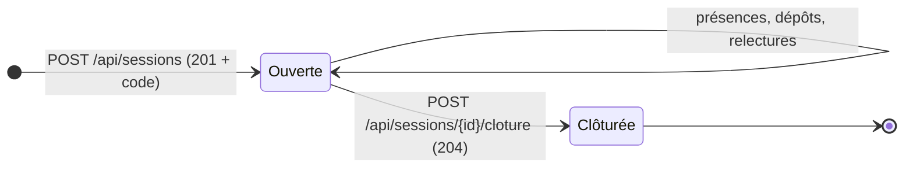
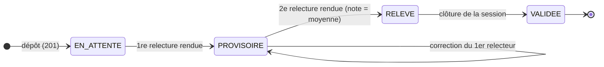
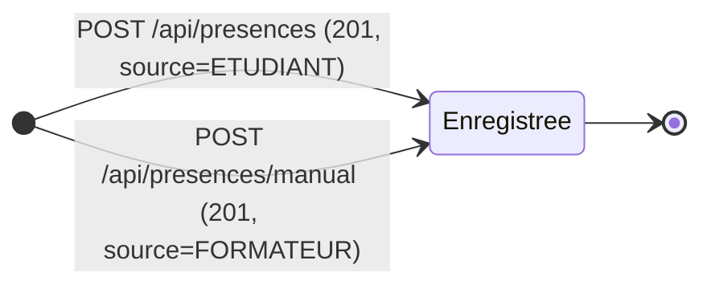

# Spécifications fonctionnelles — KOS

> Application de présence par code, dépôt d'exercices et relecture par les pairs.
> Formation KFOKAM48 · Frontend Next.js (React 19) · Backend Spring Boot 4 (Java 21) · PostgreSQL 17.
> Document aligné sur le cahier des charges v1.1 (`docs/CAHIER_DES_CHARGES.md` dans le dépôt)
> et le contrat d'API 1.2 (`api/contrat.yaml`) — incluant l'évolution de l'enveloppe :
> **deux relecteurs par exercice**.

---

## 1. Vue d'ensemble

Le formateur ouvre une session de cours et obtient un **code de présence** valable 15 minutes.
Les étudiants choisissent leur nom dans une liste (aucun mot de passe), marquent leur présence
avec le code, puis déposent le lien de leur exercice pour la session.

Chaque exercice est relu par **deux pairs différents**, choisis au hasard parmi les étudiants
présents. La note retenue est la **moyenne des deux relectures** ; si un seul relecteur a rendu,
la note est affichée mais marquée **provisoire**.

Le formateur suit le tout depuis un tableau récapitulatif : présences, exercices déposés,
moyenne et relectures en attente.

---

## 2. Acteurs et rôles

| Acteur | Ce qu'il peut faire | Ce qu'il ne peut pas faire |
|---|---|---|
| **Formateur** | Ouvrir/clôturer une session, voir le code de présence, consulter le tableau, ajouter une présence manuellement | Marquer sa propre présence, relire un exercice |
| **Étudiant (déposant)** | Choisir son nom, marquer sa présence, déposer/remplacer son lien, consulter sa note | Saisir le code d'un autre, déposer deux exercices, voir le nom de ses relecteurs |
| **Relecteur (étudiant présent)** | Rendre une note /20 + commentaire, corriger sa relecture avant clôture | Relire son propre exercice, corriger après clôture, être désigné deux fois sur le même exercice |

L'application n'a **pas d'authentification** : l'étudiant s'identifie en choisissant son nom
dans la liste (décision client Q1).

---

## 3. Exigences fonctionnelles

| Réf | Exigence | Critère d'acceptation | Priorité |
|---|---|---|---|
| EF1 | L'étudiant marque sa présence avec un code | Saisie d'un code valide et non expiré → présence visible dans le tableau avec `source=ETUDIANT` | Must |
| EF2 | L'étudiant dépose le lien de son exercice | Lien valide sur session non clôturée → exercice créé, statut `EN_ATTENTE` | Must |
| EF3 | Le système assigne un relecteur | Tirage au hasard parmi les présents, auteur exclu ; 2 relecteurs par exercice (enveloppe) | Must |
| EF4 | Le relecteur rend note et commentaire | `POST /api/relectures/{id}` avec note entière 0-20 → statut de l'exercice évolue | Must |
| EF5 | Le formateur consulte le tableau | Par étudiant : présences, exercices déposés, moyenne, relectures en attente | Must |
| EF6 | Le formateur ajoute une présence à la main | Présence créée avec `source=FORMATEUR`, visible dans le tableau (Q14) | Must |
| EF7 | Le formateur clôture la session | Plus de présence ni de dépôt ensuite ; `409 DEJA_CLOTUREE` si déjà clôturée | Must |
| EF8 | Le relecteur corrige sa note avant clôture | `PUT /api/relectures/{id}` accepté tant que la session est ouverte | Must |
| EF9 | L'étudiant relu voit sa note sans le nom du relecteur | Note et commentaire visibles, identité du relecteur jamais exposée (Q8) | Should |
| EF10 | Les exercices en attente restent visibles | Compteur et statuts visibles dans le tableau (Q11) | Must |

---

## 4. Règles de gestion

| Réf | Règle | Source |
|---|---|---|
| RG1 | Le code de présence expire **15 minutes** après l'ouverture → `410 CODE_EXPIRE` | Q2 |
| RG2 | Interdiction de relire son propre exercice → `403 AUTO_RELECTURE` | Q5 |
| RG3 | Note **entière de 0 à 20** → `400 NOTE_INVALIDE` sinon | Q9 |
| RG5 | Une présence se fait avec le code de la session en cours et non expirée | Q2, Q3 |
| RG6 | Présence **unique** par étudiant et par session (contrainte en base) → `409 DEJA_PRESENT` | Q3 |
| RG7 | Relecteur choisi **au hasard parmi les présents**, auteur et déjà-désignés exclus | Q7 + enveloppe |
| RG8 | **Deux relecteurs** par exercice ; note retenue = moyenne des deux ; un seul rendu → note **PROVISOIRE** | Q6 + enveloppe |
| RG9 | Relecture **corrigeable** tant que la session n'est pas clôturée | Q10 |
| RG10 | Après clôture, la relecture est **définitive** → `409 RELECTURE_VALIDEE` | Q15 |
| RG11 | Un exercice sans relecture rendue reste **EN_ATTENTE** et visible | Q11 |
| RG12 | Lien remplaçable **tant que personne n'a relu** → `403 RELECTURE_DEBUTEE` sinon | Q13 |
| RG13 | Dépôt impossible **après clôture** → `409 SESSION_CLOTUREE` | Q3, Q12 |
| RG14 | Présence manuelle tracée avec `source=FORMATEUR` | Q14 |
| RG15 | La **moyenne est calculée côté API** — le frontend ne la recalcule jamais | F3 |
| RG16 | L'étudiant relu voit la note mais **jamais le nom du relecteur** | Q8 |
| RG17 | Après **5 codes erronés**, blocage 2 minutes → `429 ETUDIANT_BLOQUE` | Q4 |
| RG18 | Le tirage exclut l'auteur et les relecteurs déjà désignés ; sinon `409 AUCUN_RELECTEUR_DISPONIBLE` | Q5, Q7 |
| RG19 | Le dépôt exige une session ouverte ; exercice **unique** par étudiant et par session | Q3, Q12 |

### Contradiction tranchée (Q10 / Q15)

Q10 autorise la correction, Q15 déclare la note définitive. Décision : la correction est
possible **tant que la session est ouverte** (Q10, usage réel), et devient impossible
**dès la clôture** (Q15, honnêteté des notes). Les deux réponses sont donc respectées
sur deux phases différentes du cycle de vie.

---

## 5. Cycle de vie des objets

### Session



- Expiration automatique du code 15 min après l'ouverture (RG1), sans clôture.
- Après clôture : plus de présence, plus de dépôt, relectures définitives.

### Exercice



- Le lien reste remplaçable tant qu'aucune relecture n'est **assignée** (RG12).
- Un seul des deux relecteurs a rendu → note affichée mais **provisoire**.

### Présence



- Source `ETUDIANT` ou `FORMATEUR` (tracabilité Q14).
- Course entre deux saisies simultanées : la contrainte d'unicité en base tranche,
  le second appel reçoit `409 DEJA_PRESENT`.

---

## 6. Interface API (contrat imposé + compléments)

Les **5 opérations imposées** respectent exactement l'annexe B :

| # | Opération | Succès | Erreurs |
|---|---|---|---|
| 1 | `POST /api/sessions` — ouvrir une session | `201 {id, code, ouvertureAt, expirationAt}` | `400` champ manquant |
| 2 | `POST /api/presences` — marquer sa présence | `201 {id, sessionId, etudiantId, source}` | `400 CODE_INCONNU` · `409 DEJA_PRESENT` · `410 CODE_EXPIRE` |
| 3 | `POST /api/exercices` — déposer un exercice | `201 {id, statut}` | `400 LIEN_INVALIDE` · `409 EXERCICE_DEJA_DEPOSE` |
| 4 | `POST /api/relectures/{id}` — rendre `{note, commentaire}` | `200` | `400 NOTE_INVALIDE` · `403 AUTO_RELECTURE` · `409 RELECTURE_DEJA_RENDUE` |
| 5 | `GET /api/tableau?promotionId=` — tableau | `200 [{etudiantId, nom, presences, exercicesDeposes, moyenne, relecturesEnAttente}]` | `404 PROMOTION_INCONNUE` |

**Opérations complémentaires** : assignation (`POST /api/relectures/{exerciceId}/assignation`),
correction (`PUT /api/relectures/{id}`), clôture (`POST /api/sessions/{id}/cloture`),
présence manuelle (`POST /api/presences/manual`), listes de consultation
(sessions, présences, exercices, relectures, promotions, étudiants).

**Format d'erreur imposé, pour toutes les erreurs sans exception :**

```json
{ "code": "CODE_EXPIRE", "message": "Le code de présence a expiré." }
```

Le détail complet (schémas, exemples) est dans `api/contrat.yaml` du dépôt.

---

## 7. Écrans (interface)

| Écran | Route | Fonctions |
|---|---|---|
| **Formateur** | `/` | Ouvrir une session (code affiché en grand), ajouter une présence manuelle, clôturer, tableau récapitulatif avec badge « provisoire » |
| **Étudiant** | `/etudiant` | Choisir son nom, marquer sa présence, déposer son exercice (session choisie en liste), remplacer son lien, suivre ses dépôts |
| **Relecteur** | `/relecteur` | Voir ses relectures assignées (lien de l'exercice), rendre note + commentaire, corriger avant clôture |

Contraintes d'interface : appels API regroupés dans une couche dédiée (`src/lib/api.ts`),
états de chargement et d'erreur affichés en clair, aucune règle métier recalculée côté
client (la moyenne vient de l'API), interface utilisable sur mobile (ENF1).

---

## 8. Exigences non fonctionnelles

| Réf | Exigence | Vérification |
|---|---|---|
| ENF1 | Interface utilisable sur mobile | Tableau scrollable, cibles tactiles ≥ 40 px, testée sur viewport 375 px |
| ENF2 | Tableau < 2 s pour 60 étudiants | Requête unique indexée ; mesures au curl |
| ENF3 | Erreurs lisibles, jamais de stack trace | Gestionnaire centralisé `@RestControllerAdvice`, format `{code, message}` |
| ENF4 | Démarrage simple chez un tiers | `docker compose up --build` ou 3 commandes ; données de démo chargées par Flyway |
| ENF5 | Tests qui prouvent les règles | 4 tests unitaires (RG1, RG6, Q4, nominal) + 4 intégrations PostgreSQL (Testcontainers) |

---

## 9. Traçabilité des décisions

| Point flou | Décision retenue | Source |
|---|---|---|
| Q10 vs Q15 (correction vs définitive) | Correction avant clôture, définitive après | §4 des deux réponses |
| Cycle de vie d'un exercice (non spécifié) | États EN_ATTENTE → PROVISOIRE → RELEVE → VALIDEE | Analyse (trou identifié) |
| Dépôt sans présence préalable | Exigé : une session ouverte suffit, la présence n'est pas vérifiée au dépôt | Hypothèse documentée (RG19) |
| Blocage après erreurs de code | 5 essais puis 2 minutes de blocage, en mémoire côté serveur | Q4 (RG17) |
| Un seul relecteur → deux relecteurs | Moyenne des deux notes, statut provisoire si un seul a rendu | Enveloppe (changement de besoin) |

---

*Document maintenu dans le dépôt : toute évolution fonctionnelle passe d'abord par une
issue, puis met à jour ce document, le contrat d'API et les tests.*
