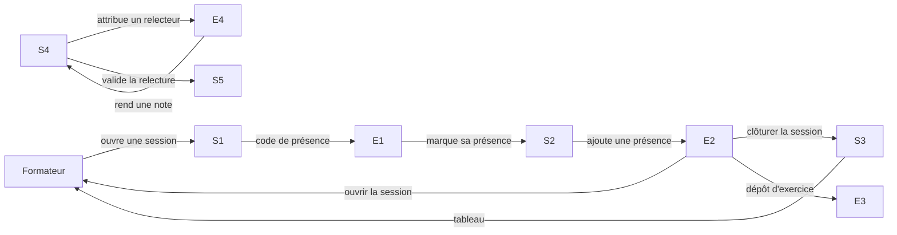
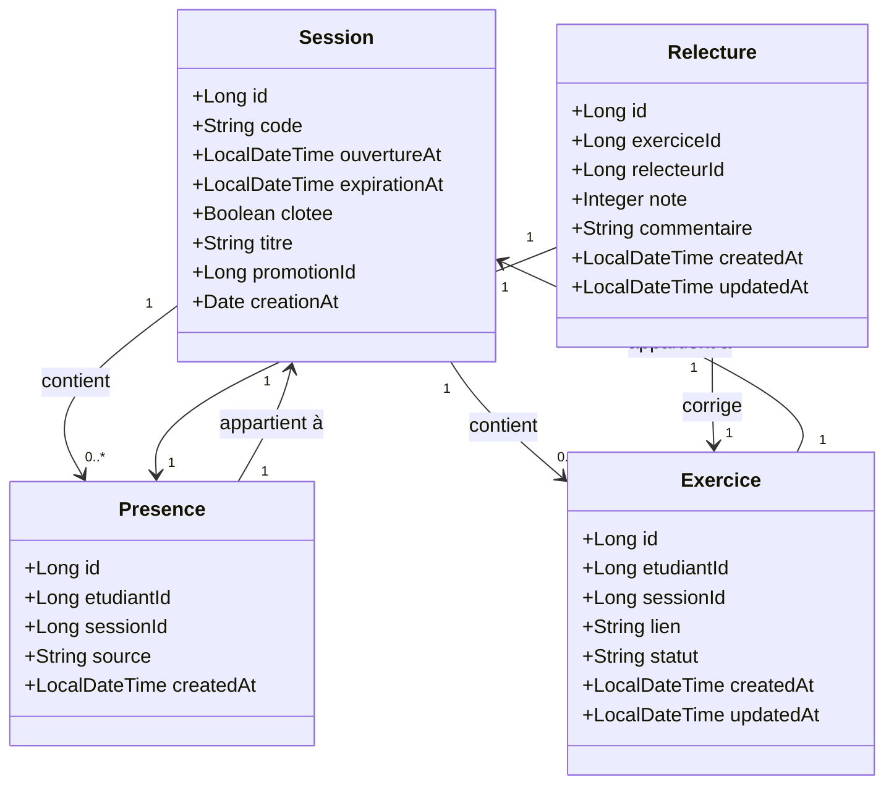
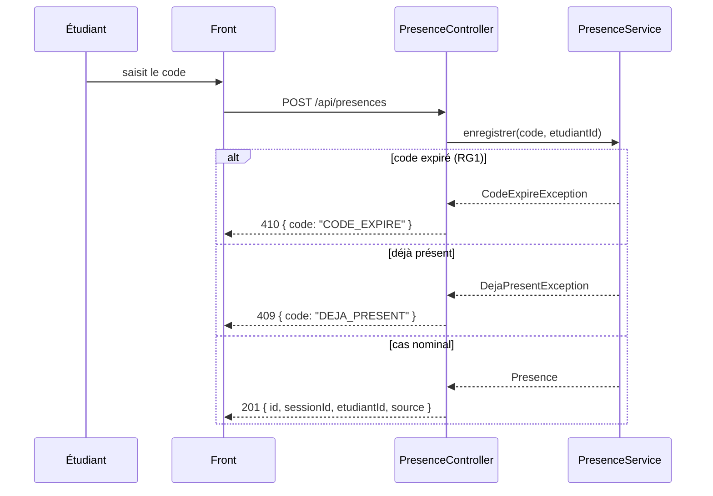
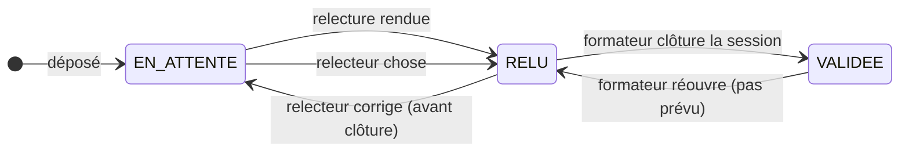

# D1 — Cas d'utilisation

# D1 — Cas d'utilisation

Les acteurs sont :
- **Formateur** : ouvre une session, marque une présence manuellement, voit le tableau, clôture une session, peut modifier une relecture avant clôture.
- **Étudiant** : marque sa présence avec un code, dépose le lien de son exercice, reçoit une note et un commentaire sur son exercice relu.
- **Relecteur** : relève l'exercice d'un pair, donne une note (0-20) et un commentaire, visible pour l'étudiant relu mais pas l'identité.

## Cas d'utilisation principale : marquer sa présence

**Acteurs :** Étudiant, Formateur, Session

**Précondition :** une session est ouverte par le formateur.

**Déclencheur :** l'étudiant saisit le code de présence.

**Flot principal :**
1. L'étudiant saisit le code.
2. L'application vérifie que le code est valide, non expiré et n'a pas déjà été utilisé.
3. L'application enregistre la présence (source = ETUDIANT).
4. L'application répond avec la présence enregistrée.

**Postcondition :** la présence de l'étudiant est visible dans le tableau du formateur.

## Cas d'utilisation complémentaire : ajouter une présence manuellement

**Acteurs :** Formateur, Session, Étudiant

**Précondition :** la session est ouverte.

**Déclencheur :** le formateur saisit l'identifiant d'un étudiant qui s'est absenté.

**Flot principal :**
1. Le formateur ajoute la présence à la main.
2. L'application enregistre la présence (source = FORMATEUR).
3. L'application répond avec la présence enregistrée.

**Postcondition :** la présence est visible dans le tableau du formateur, avec la mention "ajouté par le formateur".

## Cas d'utilisation principal : déposer un exercice

**Acteurs :** Étudiant, Session, Exercice

**Précondition :** l'étudiant est présent à la session (présence enregistrée).

**Déclencheur :** l'étudiant soumet le lien de son exercice.

**Flot principal :**
1. L'application vérifie que le lien est valide et que l'étudiant n'a pas déjà déposé d'exercice pour cette session.
2. L'application enregistre l'exercice avec le statut "en attente de relecture".
3. L'application demande à un étudiant présent de le relire (si ce n'est pas déjà fait).

**Postcondition :** l'exercice est visible dans le tableau du formateur avec le statut correspondant.

## Cas d'utilisation principal : relire un exercice

**Acteurs :** Relecteur, Étudiant, Exercice

**Précondition :** l'exercice est en attente de relecture, et le relecteur n'a pas encore relu cet exercice.

**Déclencheur :** le relecteur soumet une note et un commentaire.

**Flot principal :**
1. L'application vérifie que le relecteur ne relit pas son propre exercice.
2. L'application vérifie que la relecture n'a pas déjà été rendue.
3. L'application enregistre la relecture (note 0-20, commentaire).
4. Le statut de l'exercice passe à "relu".

**Postcondition :** l'étudiant est noté.

## Cas d'utilisation principal : vider le tableau du formateur

**Acteurs :** Formateur, Promotion

**Précondition :** le formateur a accès à une promotion.

**Déclencheur :** l'appel GET /api/tableau.

**Flot principal :**
1. L'application récupère, pour chaque étudiant de la promotion : présence, nombre d'exercices déposés, notes reçues, relectures en attente.
2. L'application répond avec un tableau structuré.

**Postcondition :** le formateur peut suivre l'avancement de ses étudiants.

# D2 — Diagramme de classes (modèle de données)

# D2 — Diagramme de classes (modèle de données)

Les entités principales sont :

- **Session** : contient le code de présence, la date d'ouverture, l'expiration (15 min après), le statut (ouverte/clôturée), le titre, la promotion.
- **Presence** : associé à un étudiant et à une session, avec une source (ETUDIANT ou FORMATEUR), correspondant à Q14 (ajout manuel par le formateur).
- **Exercice** : lié à un étudiant et à une session, avec un lien, un statut (en attente / relu / validé), la date de création et de mise à jour.
- **Relecture** : note (0-20) et commentaire, liée à un exercice et à un relecteur, avec les dates de création et de mise à jour.

L'attribut `source` de Presence est `ETUDIANT` ou `FORMATEUR`, conformément à Q14.

L'état du statut de Exercice est : `EN_ATTENTE`, `RELU`, `VALIDEE`, correspondant à Q11 (en attente) et à Q15 (validée).

# D3 — Séquence : marquer sa présence

# D3 — Séquence : marquer sa présence

Le cas nominal est le suivant :

1. L'étudiant saisit le code.
2. Le front appelle `POST /api/presences` avec le code et l'identifiant de l'étudiant.
3. Le contrôleur appelle le service.
4. Le service vérifie : code inconnu (400), déjà présent (409), code expiré (410).
5. Sinon, il enregistre la présence et renvoie 201.

Les deux cas d'erreur sont :

- **Code expiré** : 410 `{ code: "CODE_EXPIRE" }`, si le code n'est plus valide après 15 minutes d'ouverture (RG1, Q2).
- **Déjà présent** : 409 `{ code: "DEJA_PRESENT" }`, si l'étudiant a déjà marqué sa présence pour cette session (RG6, Q3).

# Diagramme bonus — États-transitions d'un exercice (optionnel)

# Diagramme bonus — États-transitions d'un exercice

Un exercice passe de `EN_ATTENTE` à `RELU` quand le relecteur rend sa relecture, puis de `RELU` à `VALIDEE` quand le formateur clôture la session. Le relecteur peut modifier sa relecture tant que la session n'est pas clôturée (Q10).

**État EN_ATTENTE** : l'exercice est déposé, aucun relecteur n'a encore relu.

**État RELU** : le relecteur a rendu sa note et son commentaire, mais la relecture n'est pas encore validée (session ouverte).

**État VALIDEE** : la session a été clôturée par le formateur, la relecture est définitive (Q15).

Note : l'état `VALIDEE` ne sera pas utilisé tant que la session n'est pas clôturée, mais il permet de modéliser le fait que la relecture ne peut plus être modifiée après clôture (Q15).

**Remarque :** l'état `RELUIT` n'existe pas, il s'agit d'un état intermédiaire. Il n'est pas modélisé car le relecteur ne peut pas modifier une relecture déjà rendue après la clôture, et l'état `RELUIT` ne sert à rien.
