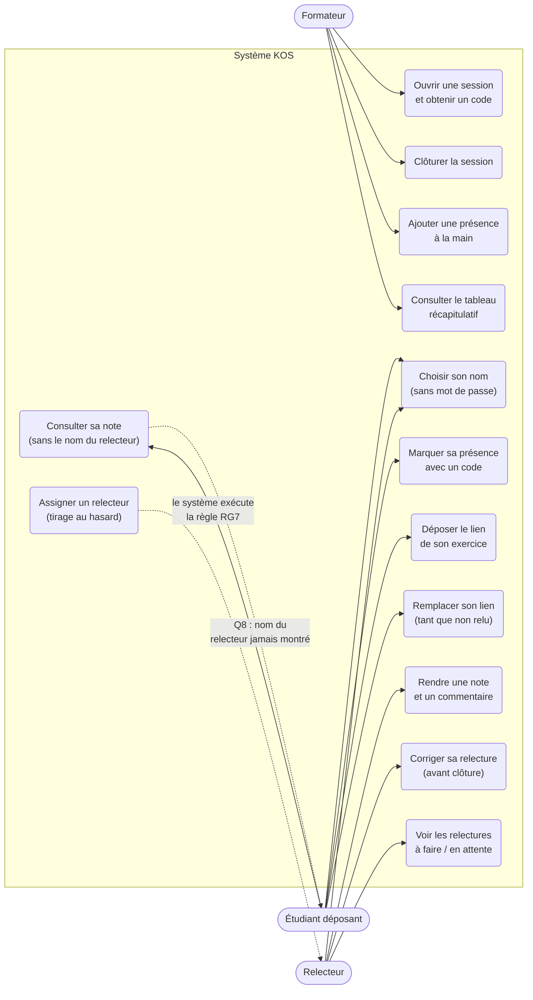

# D1 — Cas d'utilisation

## Lecture du diagramme

- **Formateur** : pilote le cycle de la session (ouverture → code → clôture), a une
  action de secours (présence manuelle, Q14) et dispose du tableau récapitulatif (Q16).
- **Étudiant déposant** : s'identifie par choix de nom (Q1), marque sa présence (EF1),
  dépose et remplace son lien (EF2, Q13), consulte sa note sans connaître le relecteur (Q8).
- **Relecteur** : un étudiant présent désigné au hasard (Q7) — il voit la liste de ses
  relectures, rend sa note /20 + commentaire (EF4) et peut corriger avant clôture (Q10).
- L'**assignation** n'est pas un cas d'utilisation humain : c'est le système qui tire
  au hasard parmi les présents, auteur exclu (RG7, RG18).

## Erreurs associées (contrat)

Chaque cas d'utilisation a ses erreurs au format `{code, message}` — voir D3 pour le
détail de « marquer sa présence » (400 CODE_INCONNU, 409 DEJA_PRESENT, 410 CODE_EXPIRE,
429 ETUDIANT_BLOQUE) et `api/contrat.yaml` pour l'exhaustivité.
