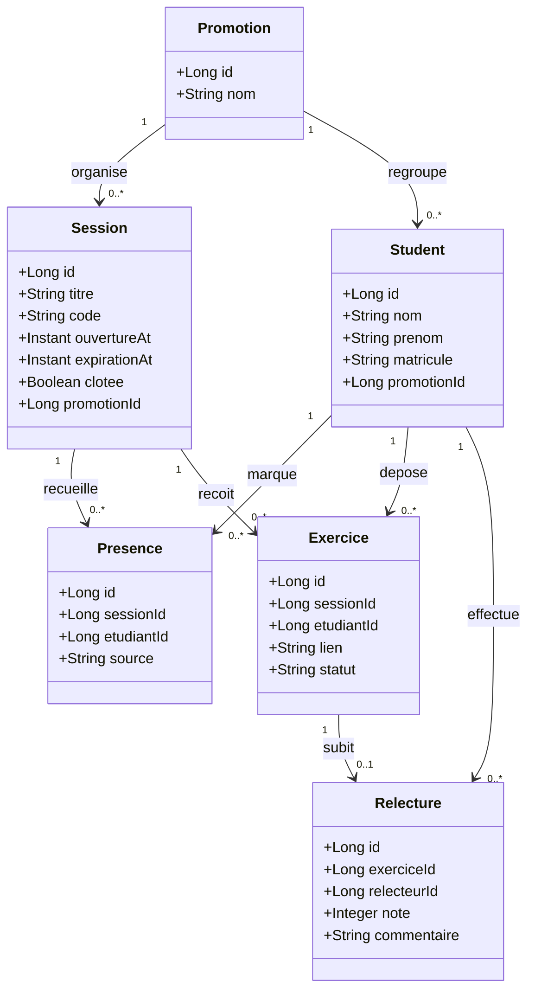

# D2 — Diagramme de classes (modèle de données)

## Correspondance avec les migrations (V1 + V3)

- **promotions** (V1) : id, nom.
- **students** (V1 + V3) : nom, prenom, matricule UNIQUE, promotion_id (tableau par promotion, Q16).
- **sessions** (V1) : titre, code, ouverture_at, expiration_at (RG1 : 15 min), clotee, promotion_id.
- **presences** (V1 + V3) : source ETUDIANT|FORMATEUR (Q14), UNIQUE (session_id, etudiant_id) = RG6.
- **exercices** (V1 + V3) : lien, statut EN_ATTENTE|RELU|VALIDEE, UNIQUE (session_id, etudiant_id).
- **relectures** (V1 + V3) : relecteur_id, note nullable (null tant que non rendue), commentaire nullable, UNIQUE (exercice_id) = RG8 (un seul relecteur, Q6).

L'attribut `source` de Presence est `ETUDIANT` ou `FORMATEUR`, conformément à Q14.

Le statut de Exercice : `EN_ATTENTE`, `RELU`, `VALIDEE`, correspondant à Q11 (en attente) et à Q15 (validée).
