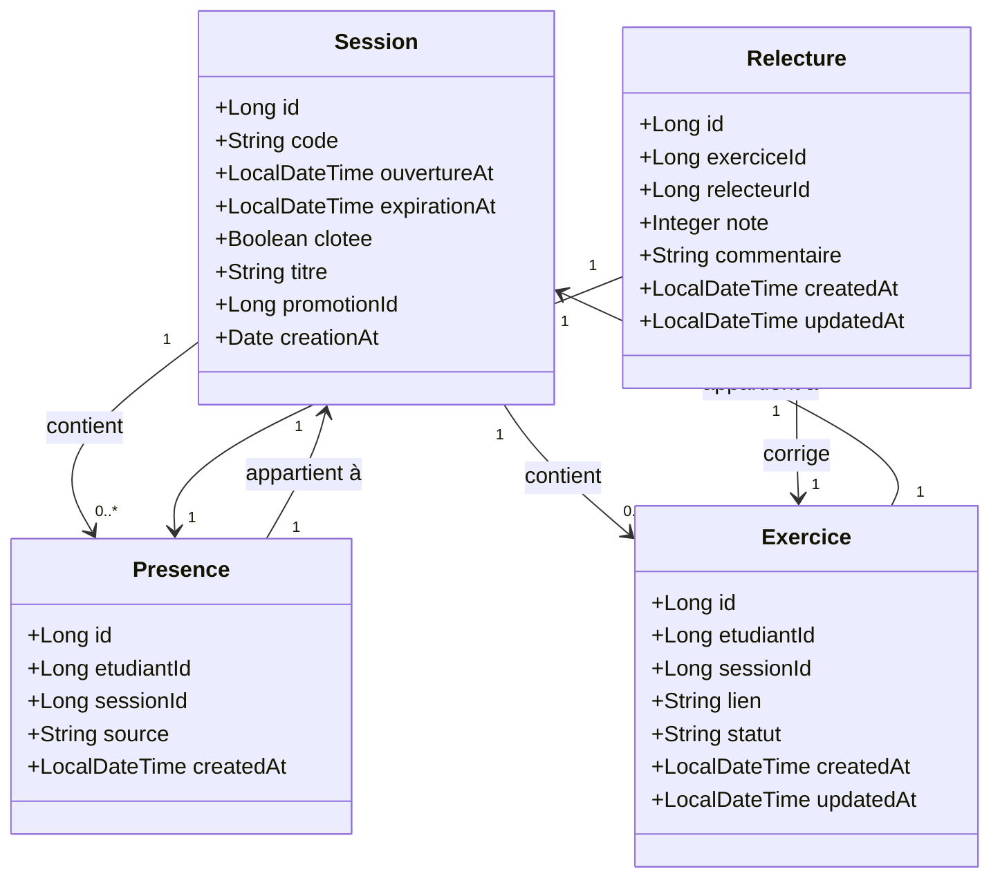

# D2 — Diagramme de classes (modèle de données)

# D2 — Diagramme de classes (modèle de données)

Les entités principales sont :

- **Session** : contient le code de présence, la date d'ouverture, l'expiration (15 min après), le statut (ouverte/clôturée), le titre, la promotion.
- **Presence** : associé à un étudiant et à une session, avec une source (ETUDIANT ou FORMATEUR), correspondant à Q14 (ajout manuel par le formateur).
- **Exercice** : lié à un étudiant et à une session, avec un lien, un statut (en attente / relu / validé), la date de création et de mise à jour.
- **Relecture** : note (0-20) et commentaire, liée à un exercice et à un relecteur, avec les dates de création et de mise à jour.

L'attribut `source` de Presence est `ETUDIANT` ou `FORMATEUR`, conformément à Q14.

L'état du statut de Exercice est : `EN_ATTENTE`, `RELU`, `VALIDEE`, correspondant à Q11 (en attente) et à Q15 (validée).

# D2 — Diagramme de classes (modèle de données)

# D2 — Diagramme de classes (modèle de données)

Les entités principales sont :

- **Session** : contient le code de présence, la date d'ouverture, l'expiration (15 min après), le statut (ouverte/clôturée), le titre, la promotion.
- **Presence** : associé à un étudiant et à une session, avec une source (ETUDIANT ou FORMATEUR), correspondant à Q14 (ajout manuel par le formateur).
- **Exercice** : lié à un étudiant et à une session, avec un lien, un statut (en attente / relu / validé), la date de création et de mise à jour.
- **Relecture** : note (0-20) et commentaire, liée à un exercice et à un relecteur, avec les dates de création et de mise à jour.

L'attribut `source` de Presence est `ETUDIANT` ou `FORMATEUR`, conformément à Q14.

L'état du statut de Exercice est : `EN_ATTENTE`, `RELU`, `VALIDEE`, correspondant à Q11 (en attente) et à Q15 (validée).
