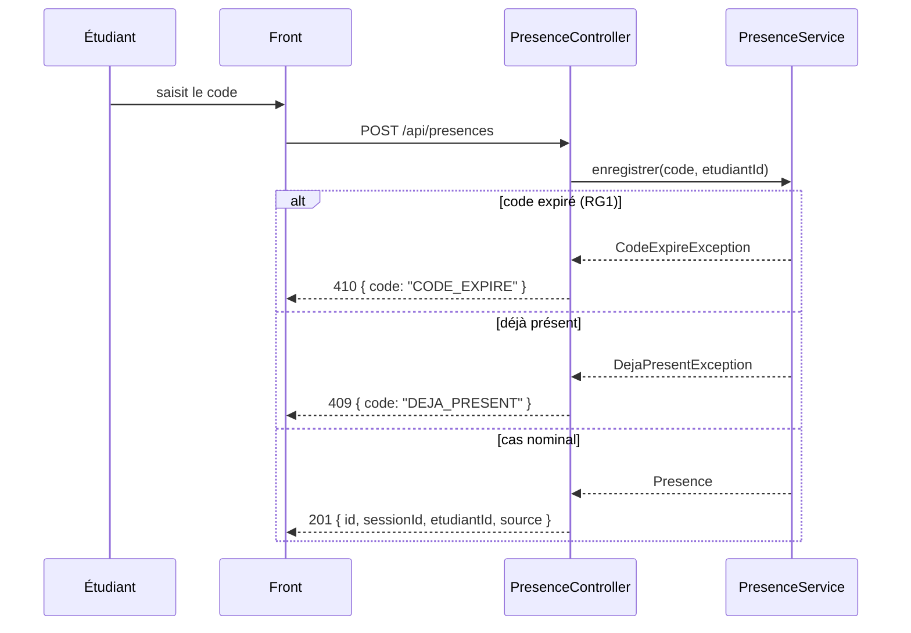
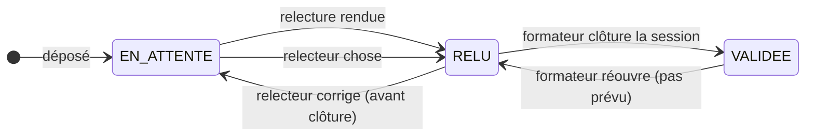

# D3 — Séquence : marquer sa présence

# D3 — Séquence : marquer sa présence

Le cas nominal est le suivant :

1. L'étudiant saisit le code.
2. Le front appelle `POST /api/presences` avec le code et l'identifiant de l'étudiant.
3. Le contrôleur appelle le service.
4. Le service vérifie : code inconnu (400), déjà présent (409), code expiré (410).
5. Sinon, il enregistre la présence et renvoie 201.

Les deux cas d'erreur sont :

- **Code expiré** : 410 `{ code: "CODE_EXPIRE" }`, si le code n'est plus valide après 15 minutes d'ouverture (RG1, Q2).
- **Déjà présent** : 409 `{ code: "DEJA_PRESENT" }`, si l'étudiant a déjà marqué sa présence pour cette session (RG6, Q3).

# Diagramme bonus — États-transitions d'un exercice (optionnel)

# Diagramme bonus — États-transitions d'un exercice

Un exercice passe de `EN_ATTENTE` à `RELU` quand le relecteur rend sa relecture, puis de `RELU` à `VALIDEE` quand le formateur clôture la session. Le relecteur peut modifier sa relecture tant que la session n'est pas clôturée (Q10).

**État EN_ATTENTE** : l'exercice est déposé, aucun relecteur n'a encore relu.

**État RELU** : le relecteur a rendu sa note et son commentaire, mais la relecture n'est pas encore validée (session ouverte).

**État VALIDEE** : la session a été clôturée par le formateur, la relecture est définitive (Q15).

Note : l'état `VALIDEE` ne sera pas utilisé tant que la session n'est pas clôturée, mais il permet de modéliser le fait que la relecture ne peut plus être modifiée après clôture (Q15).

**Remarque :** l'état `RELUIT` n'existe pas, il s'agit d'un état intermédiaire. Il n'est pas modélisé car le relecteur ne peut pas modifier une relecture déjà rendue après la clôture, et l'état `RELUIT` ne sert à rien.
