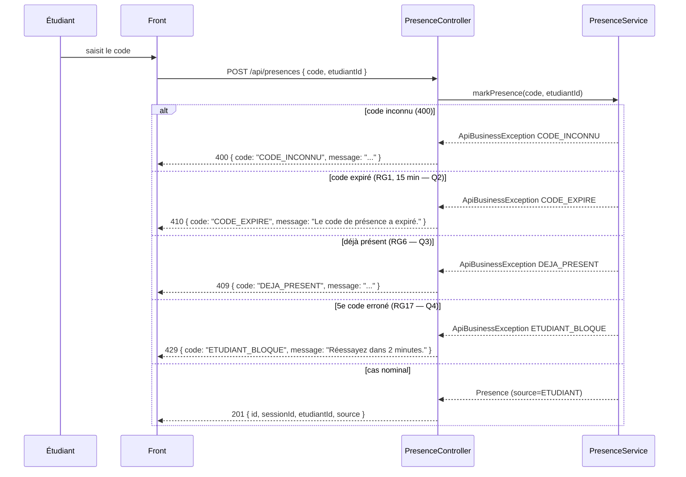
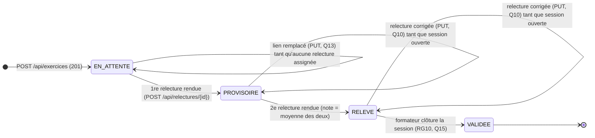

# D3 — Séquence : marquer sa présence

Le cas nominal est le suivant :

1. L'étudiant saisit le code.
2. Le front appelle `POST /api/presences` avec le code et l'identifiant de l'étudiant.
3. Le contrôleur valide le corps (`@Valid`) puis appelle le service.
4. Le service vérifie : code inconnu (400), session clôturée (409), code expiré (410),
   déjà présent (409), blocage après 5 erreurs (429).
5. Sinon, il enregistre la présence et renvoie 201.

Toutes les erreurs respectent le format imposé `{ code, message }` —
jamais de stack trace (B4).

---

# D4 (bonus) — États-transitions du cycle de vie d'un exercice

> Mis à jour à l'étape 3 (enveloppe) : chaque exercice est relu par **deux relecteurs**.
> Les anciens statuts RELU ont évolué en PROVISOIRE / RELEVE.

Un exercice passe de `EN_ATTENTE` à `PROVISOIRE` quand le **premier** des deux relecteurs
rend sa relecture, puis de `PROVISOIRE` à `RELEVE` quand le **second** rend : la note
retenue est alors la **moyenne des deux** (RG8, enveloppe).

- **EN_ATTENTE** : déposé, aucun relecteur n'a encore rendu. Le lien reste
  remplaçable tant que personne n'a relu (Q13, RG12) — une relecture **assignée**
  mais non rendue ne bloque pas le remplacement.
- **PROVISOIRE** : un seul des deux relecteurs a rendu — la note est affichée
  mais marquée provisoire ; correction possible tant que la session est ouverte (Q10, RG9).
- **RELEVE** : les deux ont rendu, la note est la moyenne des deux ; les corrections
  restent possibles tant que la session est ouverte (Q10, RG9).
- **VALIDEE** : la session est clôturée, les relectures sont définitives (Q15, RG10).
